学习 SurfaceFlinger 需要循序渐进，因为它是 Android 图形栈中最复杂的模块之一。结合刚才梳理的目录结构，我给你一套从宏观到微观、可直接落地的学习路线。

## 第一步:先建立图形栈全局认知(不要一上来读源码)

在打开 `SurfaceFlinger.cpp` 之前，必须理解它在整个 Android 图形体系中的位置，否则会被各种 BufferQueue、HWC、VSync 概念淹没。

需要掌握的相邻模块关系:
- **App 端**:`BufferQueue` + `Surface`(在 `frameworks/native/libs/gui`),应用通过 `Surface` 把绘制内容放入 BufferQueue 的生产者端。
- **SurfaceFlinger**:消费者,从各 Layer 的 BufferQueue 取出 buffer,合成后送显。
- **HWC(Hardware Composer)**:硬件合成器,决定哪些图层能由显示硬件直接叠加(`DisplayHardware/HWC2.cpp`),SF 与之协商。
- **VSync**:由 `Scheduler/` 产生,驱动 SF 的合成节奏。

建议先读官方文档和经典资料:Android 官方的 "Graphics architecture" 文档、Dan Rosenberg / 扔物线 / 代码 GG 等关于 Android 图形栈的系列文章,先把"生产者-消费者-BufferQueue-HWC-VSync"这条主线画清楚。

## 第二步:按目录分层逐个击破(对应刚才的树)

不要试图一次性读懂 `SurfaceFlinger.cpp`(它本身有数千行)。按依赖关系分层学:

1. **入口与生命周期**:先读 `main_surfaceflinger.cpp`,理解 init 拉起 → `createSurfaceFlinger()` → `init()` → `addService("SurfaceFlinger")` 注册到 servicemanager → `run()` 主循环。这对应我们前面分析的"独立进程 + binder 服务"定位。
2. **核心数据结构**:`Layer.cpp`(所有图层的基类)、`BufferQueueLayer.cpp` / `BufferStateLayer.cpp` / `ColorLayer.cpp` / `ContainerLayer.cpp`(各类具体图层)、`DisplayDevice.cpp`(显示设备)。先掌握 Layer 的状态(位置、透明度、Z 序)如何被应用通过 binder transaction 设置。
3. **合成引擎(重点,也是难点)**:`CompositionEngine/` 是 Android 10 引入的重构成果,采用"接口 + impl + mock"清晰分层。先读 `include/compositionengine/` 下的头文件(`CompositionEngine.h`、`Display.h`、`Layer.h`、`Output.h`、`RenderSurface.h`),理解"什么是 Output(一个显示目标)、什么是 OutputLayer(一个图层在某输出上的投影)"。再看 `src/` 里的实现。建议用 `SurfaceFlingerFactory.cpp` 作为入口,看各个组件如何被创建。
4. **显示硬件**:`DisplayHardware/` 下 `HWC2.cpp` / `ComposerHal.cpp` / `HWComposer.cpp`,理解 SF 如何与 HWC 协商合成方式(Client 合成 vs Device 合成)。
5. **调度与同步**:`Scheduler/`,重点 `DispSync.cpp`(软件 VSync 同步)、`EventThread.cpp`(向客户端发 VSync 事件)、`LayerHistory.cpp`(刷新率决策)。

## 第三步:抓住两条主流程(读懂即入门)

SF 运行过程中有两条最关键的主线,抓住它们就抓住了 SF 的魂:

- **合成主循环**:`SurfaceFlinger::handleMessageInvalidate()`(获取各 Layer 新 buffer)→ `handleMessageRefresh()`(真正合成)。这是每一帧发生的事。配合 `MessageQueue.cpp` 与 `Scheduler` 的 VSync 信号理解"SF 何时被唤醒、何时合成"。
- **事务提交**:应用调用 `Surface::setBuffer` / `setPosition` 等,经 binder 到达 `SurfaceFlinger::setTransactionState()`,统一在下一个 VSync 提交(`TransactionCompletedThread.cpp` 负责通知完成)。理解"事务为何要批量、延迟到 VSync 提交"是关键。

## 第四步:用调试工具反向验证(边学边看)

学到的概念要用真机/模拟器验证,这是最快的巩固方式:
- `dumpsys SurfaceFlinger`(对应前面 native cmds 分析的工具)看当前图层、显示、刷新率状态。
- `dumpsys SurfaceFlinger --proto` 配合 `SurfaceFlinger` 的 trace 能力看帧耗时。
- `adb shell service call SurfaceFlinger ...` 或 `cmd` 触发 SF 接口。
- `systrace` / `perfetto` 抓图形栈 trace,看 VSync、SF 合成、应用绘制的时间线(对应 `atrace` 的 `gfx` category)。
- 看 `SurfaceTracing.cpp` / `SurfaceInterceptor.cpp` 如何记录图层变化,理解"可观测性"在 SF 里的落地。

## 第五步:动手小改造(深化理解)

在能编译 AOSP 的环境下,做最小的修改验证机制,例如:
- 改 `ColorLayer` 让某个纯色图层变色,观察合成结果。
- 在 `handleMessageRefresh()` 加 log,数一数每帧调用频率。
- 调 `Scheduler` 的 phase offset,观察对掉帧/延迟的影响。

## 推荐学习资源顺序

1. 官方文档:Android Graphics Architecture、BufferQueue、Hardware Composer。
2. 经典博客:Android 图形系统系列(生产者/消费者、BufferQueue、SF 合成)。
3. 源码入口:`main_surfaceflinger.cpp` → `SurfaceFlinger.h`(类成员注释极多,先读头文件)→ `CompositionEngine/include`。
4. 视频/演讲:Google I/O 关于 Project Butter、VSync、SurfaceFlinger 的演讲。

## 一句话总结路线

宏观图形栈 → `main_` 入口与生命周期 → Layer/DisplayDevice 数据结构 → CompositionEngine 合成引擎 → HWC 硬件协商 → Scheduler/VSync 调度 → 抓 `dumpsys`/systrace 验证 → 小改源码编译。按这个顺序,避免直接死磕 `SurfaceFlinger.cpp` 大文件。


## 目录定位

`frameworks/native/services` 是 Android **Native 系统服务层**（C/C++）的集合，运行在 `system_server` 之外，绝大多数由 init 通过 `.rc` 文件拉起为独立进程，通过 Binder（或 HIDL/hwbinder）对外服务。它们处于架构中的 **HAL 之上、Java framework 之下** 的 "native system services" 层，是图形、输入、传感器、电源、音频等底层能力的实际执行者。

## 服务分类一览

| 服务 | 类型 | 对外接口/能力 | 形态 |
|------|------|---------------|------|
| surfaceflinger | 图形合成器 | `ISurfaceComposer`（`BnSurfaceComposer`），注册名 `SurfaceFlinger` | 独立进程 |
| inputflinger | 输入系统 | `IInputFlinger`（`BnInputFlinger`），注册名 `inputflinger` | 独立进程 |
| sensorservice | 传感器 | `ISensorServer`（`BnSensorServer`），注册名 `sensorservice` | 独立进程 |
| gpuservice | GPU 调试/统计 | `IGpuService`（`BnGpuService`），注册名 `gpu` | 独立进程 |
| bufferhub | 图形 buffer | HIDL `IBufferHub` V1_0，注册名 `system_bufferhub` | 独立进程 |
| displayservice | 显示事件 | HIDL `IDisplayService`，由 surfaceflinger 进程内启动 | SF 内注册 |
| schedulerservice | 调度优先级 | HIDL `ISchedulingPolicyService`（限 cameraserver） | 库/HIDL |
| vr | VR 聚合 | vr_hwc / bufferhubd / virtual_touchpad / performanced | 多独立进程 |
| nativeperms | native 权限 | `IPermissionController`，注册名 `permission` | 独立进程 |
| customservice | 厂商定制模板 | `IYourService` 示例 | 独立进程 |
| utils | 工具库 | `libserviceutils`（`PriorityDumper` 等） | 库 |

需要特别澄清的是：**batteryservice、powermanager、audiomanager 这三个在本目录中并不是独立服务进程，而是"接口/头文件库"**——`batteryservice` 只提供 `BatteryProperties` 等结构体常量头文件（`libbatteryservice_headers`），`powermanager` 实现 `IPowerManager.cpp` 的 binder 客户端桩（`libpowermanager`），`audiomanager` 实现 `IAudioManager.cpp`（`libaudiomanager`）。真正的电池服务在 healthd 与 Java 层 `BatteryService`，真正的 `PowerManagerService`/`AudioService` 在 Java 层。这种"native 层只放接口定义，逻辑在 Java 层"的模式是 Android 的常见分层。

## 核心服务深入

**surfaceflinger**（图形合成器，核心中的核心）：主入口 `main_surfaceflinger.cpp`，流程为 `OtherSystemServiceLoopRun()`（拉起关联服务）→ 启动 graphics allocator（`startGraphicsAllocatorService`，passthrough 的 `IAllocator`）→ 限制 binder 线程池为 4 → `createSurfaceFlinger()` 实例化 → `flinger->init()` 初始化图形硬件 → 通过 `defaultServiceManager()->addService(SurfaceFlinger::getServiceName(), flinger, ..., DUMP_FLAG_PRIORITY_CRITICAL | DUMP_FLAG_PROTO)` **注册到 servicemanager**（带 CRITICAL 优先级，支撑 `dumpsys SurfaceFlinger --proto`）→ `startDisplayService()` → 提升为 `SCHED_FIFO` 实时调度 → `flinger->run()` 进入主循环。核心实现 `SurfaceFlinger.cpp` 负责图层合成、VSync 调度；`Scheduler/` 子目录（27 文件）管理刷新率与 VSync，`CompositionEngine/`（75 文件）是 Android 10 引入的新合成引擎，`Layer.cpp`/`BufferQueueLayer.cpp`/`ColorLayer.cpp` 描述各类图层，`SurfaceTracing.cpp`/`SurfaceInterceptor.cpp` 做 trace 与拦截。

**inputflinger**（输入系统）：`InputManager.cpp` 是中枢，内部创建 `InputReader`（读设备事件，依赖 `EventHub.cpp` 从 `/dev/input` 采集）和 `InputDispatcher`（分发到目标窗口）。`InputReader.cpp`（读）、`InputDispatcher.cpp`（分发）、`InputClassifier.cpp`（输入分类，如将运动事件归并）、`InputReporter.cpp`（上报）协同工作；`host/` 子目录含 host 端调试用的独立 rc。它注册为 `inputflinger` binder 服务，被 Java 层 `InputManagerService` 通过 binder 调用以注入/监控输入。

**sensorservice**（传感器）：实现 `ISensorServer`，聚合各 sensor HAL，做数据融合（`SensorFusion` 提供虚拟重力/旋转/线性加速度传感器），并提供直连通道（direct report channel）。由 `main_sensorservice` 启动，被 Java 层 `SensorManager`/`SystemSensorManager` 通过 binder 访问。

## 与前面两轮分析的关系

这组 native 服务通过 **Binder + servicemanager** 与上两轮的 Java AMS 层和 native cmds 工具形成完整控制面：

- **与 Java 层**：Java 框架的 `WindowManagerService`、`PowerManagerService`、`SensorManager`、`InputManagerService`、`AudioService`、`BatteryService` 等都是这些 native 服务的 binder **客户端**。例如 WMS 通过 `SurfaceComposerClient` 访问 surfaceflinger 的 `ISurfaceComposer`，`InputManagerService` 持有 `IInputFlinger` 引用，Java 传感器 API 背后是 `ISensorServer`。native 服务负责实际执行（合成、分发、采集），Java 层负责策略、权限与生命周期。
- **与 native cmds**：这些 native 服务绝大多数都 `addService` 注册到 servicemanager，因此 `dumpsys SurfaceFlinger` / `dumpsys sensorservice` / `dumpsys inputflinger` 能直接遍历 servicemanager 取到对应 binder 实体并调用其 `dump()`（surfaceflinger 还特意带 `DUMP_FLAG_PROTO` 支持 proto 输出）；`lshal` 则可列出 HIDL 形态的服务（bufferhub、displayservice、schedulerservice）。这正是上一轮分析的 dumpsys/lshal 工具的访问对象。
- **分层结构**：servicemanager（cmds 里的基石）→ 这批 native services（本目录）→ HIDL/HAL（lshal 管理）→ Kernel 驱动，构成自下而上的服务栈；Java system_server（含 AMS）则通过 binder 跨进程悬挂在这层 native 服务之上。

## 架构观察

Android 10 此目录呈现几个趋势：一是**接口与实现分离**（batteryservice/powermanager/audiomanager 退化为纯接口库，逻辑上移 Java 层）；二是 **HIDL 化**（bufferhub、displayservice、schedulerservice 走 hwbinder，体现 Treble 隔离）；三是 **surfaceflinger 模块化加深**（CompositionEngine、Scheduler 独立成子目录，`SurfaceFlingerFactory` 提供工厂便于测试）；四是 **新增 gpuservice** 统一 GPU 统计与驱动信息收集。`utils` 库的 `PriorityDumper` 则被各服务复用，与 dumpsys 的优先级机制呼应。

需要我进一步展开某个服务的函数级流程吗？例如 surfaceflinger 的合成主循环（`handleMessageInvalidate`/`handleMessageRefresh`）、inputflinger 的 `InputDispatcher` 分发策略，或 sensorservice 的 `SensorFusion` 融合算法。


-
Based on the directory exploration, here is the complete tree structure of `frameworks/native/services/surfaceflinger`:

```
surfaceflinger/
├── (root)
│   ├── main_surfaceflinger.cpp          # 主入口,进程启动
│   ├── SurfaceFlinger.cpp / .h         # 合成器核心实现
│   ├── SurfaceFlingerFactory.cpp/.h     # 工厂模式,便于测试
│   ├── SurfaceInterceptor.cpp/.h        # 输入事件拦截
│   ├── SurfaceTracing.cpp/.h            # 图层 trace
│   ├── Layer.cpp / .h                   # 图层基类
│   ├── BufferQueueLayer.cpp/.h          # 带 BufferQueue 的图层
│   ├── BufferStateLayer.cpp/.h          # 缓冲状态图层
│   ├── ColorLayer.cpp / .h             # 纯色图层
│   ├── ContainerLayer.cpp/.h           # 容器图层
│   ├── DisplayDevice.cpp/.h            # 显示设备抽象
│   ├── DisplayDeviceState.h
│   ├── FrameTracker.cpp/.h
│   ├── MonitoredProducer.cpp/.h
│   ├── GpuTileRenderer / GpuVirtualDisplayDevice?
│   ├── Android.bp / Android.mk         # 构建配置
│   ├── surfaceflinger.rc                # init 启动脚本
│   ├── start_realtime / ......
├── CompositionEngine/                   # Android 10 新合成引擎
│   ├── include/compositionengine/
│   │   ├── CompositionEngine.h          # 引擎入口
│   │   ├── Display.h                    # 显示抽象
│   │   ├── DisplayColorProfile.h        # 颜色配置
│   │   ├── DisplaySurface.h
│   │   ├── Layer.h                      # 图层合成接口
│   │   ├── LayerFE.h                    # Layer Front-End
│   │   ├── Output.h                     # 输出目标
│   │   ├── OutputLayer.h
│   │   ├── RenderSurface.h
│   │   ├── *CreationArgs.h (Display/Layer/RenderSurface)
│   │   ├── LayerFECompositionState.h
│   │   ├── impl/                        # 接口实现 [12 个 .h]
│   │   │   └── (DisplayImpl, LayerImpl, OutputImpl, ...)
│   │   └── mock/                        # 测试 mock [10 个 .h]
│   │       └── (MockDisplay, MockLayer, MockOutput, ...)
│   └── src/                             # 实现文件 [13 个 .cpp]
│       ├── CompositionEngine.cpp
│       ├── Display.cpp
│       ├── DisplayColorProfile.cpp
│       ├── DisplaySurface.cpp
│       ├── DumpHelpers.cpp
│       ├── HwcBufferCache.cpp
│       ├── Layer.cpp
│       ├── LayerCompositionState.cpp
│       ├── Output.cpp
│       ├── OutputCompositionState.cpp
│       ├── OutputLayer.cpp
│       ├── OutputLayerCompositionState.cpp
│       └── RenderSurface.cpp
├── DisplayHardware/                      # 显示硬件抽象层
│   ├── ComposerHal.cpp/.h               # HWC HAL 封装
│   ├── HWC2.cpp / .h                    # HWC 2.0 封装
│   ├── DisplaySurface.cpp/.h           # 显示表面(surface)
│   ├── FramebufferSurface.cpp/.h       # 帧缓冲表面
│   ├── VirtualDisplaySurface.cpp/.h    # 虚拟显示
│   ├── HWComposer.cpp/.h               # 硬件合成器
│   ├── PowerAdvisor.cpp/.h
│   ├── HWc2LayerStats?
│   └── (其他硬件相关封装)
├── Scheduler/                            # 刷新率与 VSync 调度
│   ├── (Scheduler.cpp/.h)
│   ├── (DispSync.cpp/.h)                # 显示同步
│   ├── (EventThread.cpp/.h)            # 事件线程
│   ├── (VSyncReactor.cpp/.h)
│   ├── (PhaseOffsets.cpp/.h)
│   ├── (LayerHistory.cpp/.h)           # 图层历史(用于刷新率决策)
│   └── (其他调度文件)
├── TimeStats/                            # 帧时间统计
│   ├── TimeStats.cpp/.h
│   └── timestatsproto/                  # 统计数据 proto 定义
│       ├── include/timestatsproto/
│       ├── timestats.proto
│       ├── TimeStatsHelper.cpp
│       └── Android.bp
├── Effects/                              # 特效
│   └── (效果相关实现)
├── EventLog/                             # 事件日志
│   └── (事件记录)
├── layerproto/                           # 图层信息 proto 序列化
│   ├── include/layerproto/
│   │   ├── LayerProtoHeader.h
│   │   └── LayerProtoParser.h
│   └── (LayerProto 相关 .proto/.cpp)
├── sysprop/                              # 系统属性 API
│   ├── api/                              # 属性 API 版本记录
│   │   ├── current.txt
│   │   ├── removed.txt
│   │   ├── system-current.txt
│   │   ├── system-removed.txt
│   │   ├── test-current.txt
│   │   └── test-removed.txt
│   └── (sysprop 定义 .sysprop)
└── tests/                                # 单元测试与集成测试
    └── (各模块测试代码)
```

## 结构要点说明

- **根目录**是 surfaceflinger 进程主体：`main_surfaceflinger.cpp` 入口，`SurfaceFlinger.cpp` 核心合成逻辑，`Layer*.cpp` 各类图层，`DisplayDevice.cpp` 显示设备，`surfaceflinger.rc` 由 init 拉起，`Android.bp` 定义 `libsurfaceflinger` 等库。
- **CompositionEngine/** 是 Android 10 引入的新合成引擎，采用接口（`include/compositionengine/*.h`）+ 实现（`impl/`）+ mock（`mock/`，便于测试）的清晰分层，`src/` 提供 13 个 `.cpp` 实现。这是 SF 架构模块化的核心体现。
- **DisplayHardware/** 封装 HWC 2.0、Composer HAL、帧缓冲/虚拟显示表面，是 SF 与显示驱动之间的桥梁。
- **Scheduler/** 负责 VSync 产生、DispSync 同步、刷新率决策（LayerHistory 用于智能刷新率选择）。
- **TimeStats/ + layerproto/ + sysprop/** 分别负责帧耗时统计、图层状态序列化、系统属性 API，都是可观测性与配置的一部分，配合 `dumpsys SurfaceFlinger` 输出。


下面把官方文档与主流中文系列文章整合，按"生产者-消费者-BufferQueue-HWC-VSync"主线梳理成一份清晰的知识地图，并配一张可直接照着画的架构图。

## 一、整体架构图（建议照此手绘）

```
┌─────────────────────────────────────────────────────────────────┐
│  应用进程（生产者 Producer）                                        │
│  Canvas / OpenGL ES / Vulkan                                       │
│        │ dequeueBuffer()                                           │
│        ▼                                                          │
│   Surface（IGraphicBufferProducer 的客户端）                        │
└───────────────────────────────┬─────────────────────────────────┘
                                 │ 跨进程 binder（GraphicBuffer 句柄 + Fence）
                                 ▼
┌─────────────────────────────────────────────────────────────────┐
│   BufferQueue（粘合剂，一对队列，通常 64 或 2~3 个 slot）            │
│   FREE → DEQUEUED → QUEUED → ACQUIRED → FREE（循环）              │
└───────────────────────────────┬─────────────────────────────────┘
                                 │ acquireBuffer() / releaseBuffer()
                                 ▼
┌─────────────────────────────────────────────────────────────────┐
│   SurfaceFlinger（消费者 Consumer + 合成器 Composer）               │
│   1. 收到 VSync 信号被唤醒                                         │
│   2. handleMessageInvalidate：从各 Layer 的 BufferQueue acquire   │
│   3. 制定合成策略（问 HWC）：哪些层走 Device 合成、哪些走 Client  │
│   4. handleMessageRefresh：合成                                   │
│        ├─ Device 合成：直接交给 HWC 硬件叠加（省电）               │
│        └─ Client 合成：GPU 经 RenderEngine 画到离屏 buffer        │
│   5. 将结果 present 给显示（经 HWC / FramebufferSurface）          │
└───────────────────────────────┬─────────────────────────────────┘
                                 │ HWC HAL（hwbinder）
                                 ▼
┌─────────────────────────────────────────────────────────────────┐
│   Hardware Composer（HWC2，显示控制器硬件）                         │
│   - 产生 VSync 信号，回传给 SurfaceFlinger                         │
│   - 负责 Device 合成（Overlay 叠加），上报各层能否硬件合成          │
└───────────────────────────────┬─────────────────────────────────┘
                                 │
                                 ▼
                          屏幕显示（Display）
```

## 二、主线逐段拆解

**1. 生产者-消费者模型（谁生产、谁消费）**
官方文档把左侧对象称为"生成图形缓冲区的渲染器"（主屏、状态栏、系统 UI、各 App），它们通过 Canvas/GL/Vulkan 把像素写入 `Surface`；`SurfaceFlinger` 是合成器（也是消费者）；硬件混合渲染器（HWC）是混合渲染器。缓冲区的移动全部依赖 BufferQueue，这是安卓图形组件之间的"粘合剂"。

**2. BufferQueue：连接 Surface 与 Layer 的纽带**
`BufferQueue` 是一对队列，调解缓冲区从生产方到消耗方的固定周期流转。关键点：
- 应用绘制实际是渲染到 BufferQueue 中的一个 `GraphicBuffer`，通过 `IGraphicBufferProducer` 提交。
- **状态机（最重要，务必背下来）**：`FREE`（BufferQueue 持有，可被分配）→ `DEQUEUED`（生产者 dequeue 后持有，可填充）→ `QUEUED`（queueBuffer 后入队，触发 onFrameAvailable 通知消费者）→ `ACQUIRED`（SurfaceFlinger acquireBuffer 后正在消费）→ 消费完 `releaseBuffer` 回到 `FREE`。严格的单向迁移保证消费者用 buffer 时的数据安全。
- 队列长度通常有限（经典实现用一组 BufferSlot，常见 2~3 个），流转动不畅就会触发"等待 buffer"的掉帧（这就是 `waiting for buffer` 类性能问题的根源）。

**3. VSync：合成与绘制的节拍器**
- VSync 由显示控制器（Display Controller，如 DP/HDMI 控制器）通过硬件定时器产生，经 HWC HAL 传递给 SurfaceFlinger（对应源码 `Scheduler/` 与 `DisplayHardware/HWC2.cpp`）。
- Android 7.0+ 起，垂直同步调度由 SurfaceFlinger 与 HWC 共同完成。SF 收到 VSync 后被唤醒，准备合成：`handleMessageInvalidate` 取各 Layer 新 buffer，`handleMessageRefresh` 真正合成，必须在下一个 VSync 前完成（60Hz 约 16.6ms）。
- `DispSync`/`EventThread`（在 `Scheduler/` 下）负责把硬件 VSync 同步后分发给应用端（驱动 Choreographer 的帧回调）与 SF 端。

**4. HWC 与两种合成方式（决定省电与画质）**
SF 每帧都要与 HWC 协商合成策略（对应 `DisplayHardware/HWComposer.cpp` 的 `prepare`/`set`）：
- **Device 合成（首选）**：把多个图层直接交给显示控制器硬件叠加（Overlay），几乎不耗 GPU、最省电。
- **Client 合成（降级）**：当效果复杂（如圆角+阴影、模糊、旋转）硬件做不了时，由 GPU 经 RenderEngine 把所有图层画到一块离屏 buffer，再交给 HWC 当单个图层显示。
SF 的 `CompositionEngine`（`CompositionEngine/` 目录）就是负责"问 HWC → 决策 → 调用 RenderEngine 或 HWC 完成合成"的桥梁。

## 三、学习资料整合清单（按阅读顺序）

**官方（权威，先读）**
1. Android 图形架构总览（source.android.com，含上图与 BufferQueue 说明）：https://source.android.com/docs/core/graphics?hl=zh-cn
2. SurfaceFlinger 与 WindowManager 架构：https://source.android.com/docs/core/graphics/arch-sf-wm
3. BufferQueue 与同步（Fence）官方说明：在图形架构文档的 "BufferQueue" / "Synchronization" 小节

**中文系列（配合源码，循序渐进）**
4. 知乎专栏《SurfaceFlinger BufferQueue 生产者-消费者模型》：https://zhuanlan.zhihu.com/p/2020627251016803365 —— 讲清 BufferQueue 状态机与 dequeue/queue/acquire/release 全流程
5. 知乎专栏《SurfaceFlinger 合成流程详解》（六步合成）：https://zhuanlan.zhihu.com/p/2020628128259667456 —— preComposition → rebuildLayerStacks → 合成策略 → present
6. 掘金《Android 图形系统核心：BufferQueue 的深度解析》：https://juejin.cn/post/7473524943701147657
7. CSDN《Android 图形架构之四——图形缓冲区的申请和消费流程》：https://blog.csdn.net/xx326664162/article/details/109029695
8. 掘金《Android14 显示系统剖 10 — SurfaceFlinger 图层合成与 CompositionEngine》：https://juejin.cn/post/7410657936714432547 —— 对应前面源码分析的 `CompositionEngine/`

**动手验证（边学边看，固化理解）**
9. `dumpsys SurfaceFlinger` 看当前图层、显示、刷新率（前面 native cmds 分析过的工具）
10. `systrace`/`perfetto` 抓 `gfx` category，观察 VSync → 应用绘制 → SF 合成 → 上屏的时间线

## 四、一句话主线串联

应用（生产者）经 `dequeueBuffer`/`queueBuffer` 把画好的 `GraphicBuffer` 放进 `BufferQueue`；`SurfaceFlinger`（消费者）在 `VSync` 节拍下 `acquireBuffer` 取出各层 buffer，与 `HWC` 协商出"哪些 Device 合成、哪些 Client(GPU) 合成"，合成结果经 HWC 送屏幕。BufferQueue 是粘合剂，VSync 是节拍器，HWC 决定合成方式与省电与否——这就是安卓图形栈的主干。


`dumpsys SurfaceFlinger` 是分析图形栈最常用的命令，它会输出当前 SurfaceFlinger 的完整运行时状态。下面先说明它怎么用、输出分哪几块,再结合你正在学的源码解释每块对应的代码位置,最后给出真实输出示例该怎么读。

## 一、基本用法

```bash
# 完整 dump(内容很长)
adb shell dumpsys SurfaceFlinger

# 只看图层列表(最常用,排查重叠/黑屏)
adb shell dumpsys SurfaceFlinger --list

# 按图层名过滤
adb shell dumpsys SurfaceFlinger | grep -A 20 "WindowScene"

# 按层 dump(高亮某个包名)
adb shell dumpsys SurfaceFlinger | grep -i "com.android"

# proto 格式(机器解析/脚本)
adb shell dumpsys SurfaceFlinger --proto > sf.pb

# 只 dump 某个 Display 或统计
adb shell dumpsys SurfaceFlinger -s        # 简化
adb shell dumpsys SurfaceFlinger --timestats  # 帧耗时统计(TimeStats)
```

注意:SurfaceFlinger 注册到 servicemanager 时带了 `DUMP_FLAG_PRIORITY_CRITICAL`,所以 `dumpsys -l` 或系统低内存时它会优先被 dump(对应前面分析的 `main_surfaceflinger.cpp` 注册逻辑与 `native cmds` 的优先级机制)。

## 二、输出分段结构(自上而下)

一个典型 `dumpsys SurfaceFlinger` 输出大致分这几块,每块对应源码位置:

| 输出段落 | 内容 | 对应源码 |
|----------|------|----------|
| **SurfaceFlinger global state** | 版本、`DEBUG`、`primary display`、全局开关 | `SurfaceFlinger.cpp` 的 `dump()` 头部 |
| **Displays** | 每个 Display 的分辨率、刷新率、HWC 能力、图层栈 | `DisplayDevice.cpp` / `DisplayHardware/HWComposer.cpp` |
| **Layers** | 所有 Layer 列表:包名、尺寸、透明度、Z 序、缓冲状态、所属 display | `Layer.cpp` 的 `dump()`、`LayerProtoHelper.cpp` |
| **HWC / composer state** | 各层被 HWC 分配为 `Device` 还是 `Client` 合成 | `DisplayHardware/HWComposer.cpp` 的 `dump()` |
| **Scheduler / VSync** | 当前刷新率、VSync 源、phase offset | `Scheduler/Scheduler.cpp`、`PhaseOffsets.cpp` |
| **TimeStats** | 帧耗时、掉帧统计 | `TimeStats/TimeStats.cpp` |
| **BufferQueues / alloc** | 各层 BufferQueue 缓冲占用 | `BufferQueueLayer.cpp` |

核心分层思路:想知道"现在屏幕上有哪些图层"看 **Layers**;想知道"为什么卡/为什么耗电"看 **HWC** 与 **TimeStats**;想知道"刷新率对不对"看 **Scheduler**。

## 三、关键字段怎么读(Layers 段举例)

一个 Layer 的常见 dump 字段含义:

- `android.XXX/...#0` —— 包名 + 窗口标识
- `+ (0x...) 1...` —— 图层 flags(如 `BUFFER`、`COLOR`、`HIDDEN`)
- `Region` / `active_buffer` —— 当前可见区域与缓冲尺寸
- `z=...` —— Z 序,数值越大越靠上
- `alpha=...` —— 透明度(1.0 不透明)
- `crop` / `frame` —— 裁切与显示位置
- `buffer: +0x...` / `state=ACQUIRED|QUEUED` —— 该层 BufferQueue 当前缓冲状态(对应前面讲的 BufferQueue 状态机)

判断黑屏/闪烁的常用线索:某 Layer `HIDDEN`、某层 `alpha=0`、`state` 长时间停在 `QUEUED`(消费者没 acquire,可能 SF 卡住)、多个层都被强制 `Client` 合成(耗电)。

## 四、HWC 合成决策段(最影响性能)

```text
Display 0 HWC layers:
  Layer 0 (StatusBar#0): Device
  Layer 1 (NavigationBar#0): Device
  Layer 2 (com.android.launcher#0): Device
  Layer 3 (SomeApp#0): Client     <-- 这一层走了 GPU 合成
```

`Device` = 硬件叠加(省电);`Client` = 交给 GPU 经 RenderEngine 画(耗电、易掉帧)。如果某应用大量图层被标 `Client`,通常是圆角/阴影/模糊等效果导致 HWC 无法处理,对应 `CompositionEngine` 与 `HWComposer::prepare/set` 的协商结果。

## 五、建议的实际排查流程

1. `adb shell dumpsys SurfaceFlinger --list` 看当前有几个图层、有没有预期之外的图层。
2. 全量 dump 后搜目标包名,看其 `z`/`alpha`/`state` 是否正常。
3. 看 HWC 段确认有没有本可 Device 合成却变成 Client 的层。
4. 卡顿就结合 `dumpsys SurfaceFlinger --timestats` 看帧耗时分布,再配合 `systrace` 的 `gfx` 段定位是应用绘制慢还是 SF 合成慢。

---

需要我帮你**实际跑一次并解读输出**吗?如果你有设备的 `dumpsys SurfaceFlinger` 文本(可以直接贴出来,或 `adb shell dumpsys SurfaceFlinger > sf.txt` 后把文件放到工作区),我可以逐段对照上面讲的字段帮你分析当前图形状态、定位卡顿或显示异常。或者我也可以就某一块(比如 TimeStats 帧耗时、或 HWC 决策)展开讲解它在 `SurfaceFlinger.cpp` / `HWComposer.cpp` 里具体是怎么 dump 出来的。


// dumps_surfaceflinger.md

The file was empty before. Let me re-read it to check if content was added.
这份 `dumpsys SurfaceFlinger` 来自一台 **720×1440 / 60Hz** 的 Qualcomm 设备（Adreno 610，Android 10），当前前台是 `com.yto.customermanmagererp` 的 `HomeActivity`。下面按 dump 的逻辑段逐一解读，并标注对应的源码位置。

## 1. 设备与构建配置（Build configuration / Display）

- `Display 19260618794624641 (HWC display 0): port=129 pnpId=QCM` —— 内置主屏，HWC 分配 display id 0。
- `FORCE_HWC_FOR_RBG_TO_YUV=1` —— 强制把 RGB→YUV 走 HWC（厂商定制，省电但可能增加色彩误差）。
- `MAX_VIRT_DISPLAY_DIM=0`、`NUM_FRAMEBUFFER_SURFACE_BUFFERS=2` —— 帧缓冲用 2 个 buffer（双缓冲）。
- 显示尺寸 `720×1440`（DP 1.98 缩放壁纸为 480×800），DPI 281.35，物理竖屏。

对应源码：`SurfaceFlinger.cpp` 的 `dump()` 头部 + `DisplayHardware/HWComposer.cpp` 的 display 枚举。

## 2. Scheduler / VSync（第 18–93 行）

- `app phase / SF phase = 1000000 ns`、present offset = 0、`VSYNC period = 16666666 ns`（=16.67ms，即 60Hz）。
- `Touch timer: 200 ms`、`Idle timer: off`、`content detection: off` —— 无动态刷新率，固定 60Hz。
- `VsyncReactor in use`、`mIdealPeriod=16.67`、`Refresh Rate Map` 仅一个 16.67ms 档位 → 这是**静态 60Hz**，没有可变刷新率（对比之前讲的 `LayerHistory` 在这里没起作用）。
- `Total missed frame count: 5087`，其中 `HWC missed 2232`、`GPU missed 4142` —— GPU 端掉帧（走 Client 合成）明显多于 HWC 端。
- `Static screen stats: 7+ frames: 87.0%` —— 屏幕绝大多数时间停留在同一帧（静态屏），正常。

对应源码：`Scheduler/Scheduler.cpp`、`VsyncReactor.cpp`、`PhaseOffsets.cpp`、`TimeStats/`。

## 3. Buffering stats（第 109–203 行）

每个 Layer 给出 `Two/Double/Triple buffered` 占比。关键观察：
- `InputMethod#0`：`<Two buffer> 0.966` 几乎总是双缓冲——输入法 Surface 长期存在。
- `com.yto.customermanmagererp/.../HomeActivity#0`：Triple 0.457，Double 0.543——主界面三缓冲偏高，说明**该界面提交频率接近或超过 60Hz**，缓冲来不及回收。
- `ColorFade#0`：Triple 0.966——息屏/亮屏渐变动画（ColorFade 是屏幕淡入淡出层）。
- 大量 `PopupWindow:*` 和 `Application Not Responding: com.yto.customermanager#0` 出现在历史列表里 —— 说明这台设备**出现过 ANR**（com.yto.customermanager），且弹窗频繁。

对应源码：`TimeStats/` + `Layer.cpp` 的缓冲统计。

## 4. Visible layers（第 204 行起，count=64）

全系统登记了 64 个 Layer（多数不可见，仅结构存在）。真正参与本帧合成的是 3 个（见第 476 行 `3 Layers`）：
- `HomeActivity#0`（z=0，全屏 720×1440）
- `StatusBar#0`（z=1，顶 48px）
- `NavigationBar0#0`（z=2，底 96px，pos y=1344）

注意前面那些 `Task=1#0` / `Task=4393#0` 等 `EffectLayer` 的 `composition type=INVALID (0)`、`buffer: slot=-1 buffer=0x0` —— 它们是**任务容器/分屏占位 Layer，当前没有实际 buffer 不参与合成**（对应 `EffectLayer` 用于 Dim/动画遮罩）。

`ImageWallpaper#0` 显示 `composition type=DEVICE (2)`、`geomLayerTransform 0x05 (SCALE TRANSLATE)`、`tr=[1.98,0,0,1.98]`、`pos=(-36,-72)`、`size=480×800` → 壁纸被 1.98 倍放大铺满，但它在最终 `3 Layers` 合成列表里**没出现**，说明当前 HomeActivity 不透明（isOpaque=true）把它完全盖住了。

对应源码：`Layer.cpp` 的 `dump()` + `CompositionEngine` 的 `OutputLayer` 构建。

## 5. Displays / FramebufferSurface（第 447–474 行）

- `powerMode=On`、`activeConfig=0`、`usesClientComposition=true usesDeviceComposition=false` —— **本帧整体走 Client 合成**（GPU 把三块画到 client target buffer 再送 HWC）。
- FramebufferSurface 的 BufferQueue：`mMaxAcquiredBufferCount=1 mMaxDequeuedBufferCount=1`、2 个 slot，当前 `slot0=ACQUIRED frame=75555`、`slot1=FREE frame=75554` —— 标准双缓冲轮转。
- `producer=[807:???]` 是 SF 自己（`/system/bin/surfaceflinger` pid 856 是 consumer），通过 `FramebufferSurface` 把合成结果送显。

对应源码：`FramebufferSurface.cpp`、`DisplayDevice.cpp`。

## 6. 合成决策（第 476–516 行 + HWC 段第 567–592 行）—— 核心性能线索

Output Layer 三段 `hwc: layer=... composition=CLIENT (1)`：
```
HomeActivity#0     hwc: composition=CLIENT
StatusBar#0        hwc: composition=CLIENT
NavigationBar0#0   hwc: composition=CLIENT
```
HWC 段进一步确认：
```
layer 6254 z:0 composition: Client/Client  RGBA_8888_UBWC
layer 6134 z:1 composition: Client/Client
layer 6253 z:2 composition: Client/Client
---------client target---------  RGBA_8888_UBWC  buffer_id ...
```
**所有可见层都被 HWC 判为 CLIENT 合成，最终由 SDM 的 `GPU_TARGET | Pipe-1` 一块合成**（第 627 行：`| 3 | GPU_TARGET | Pipe-1 | 62 | 768x1440 | RGBA_8888_UBWC | 0 0 720 1440 | Z=0 |`）。

这点值得注意：理论上 StatusBar/NavigationBar 这种简单矩形**本可走 Device 合成（Overlay）省电**，但这台设备却全走 GPU 的 `GPU_TARGET`。可能原因：(a) `FORCE_HWC_FOR_RBG_TO_YUV=1` 改变了 HWC 策略；(b) 厂商 SDM 配置把 mixer stages 限制为 `max. mixer stages: 4` 但实际只用了 GPU pipe；(c) HWC 的 `usesDeviceComposition=false` 在 display 状态里被置位。对耗电/性能而言，这意味着每帧都要 GPU 全屏渲染，是优化点。

对应源码：`DisplayHardware/HWComposer.cpp` 的 `prepare/set` + `DisplayHardware/ComposerHal.cpp`；SDM 是 QCOM 闭源 HAL，对应 `------------SDM----------------` 段。

## 7. Global state / EGL / GLES（第 518–563 行）

- `EGL 1.5`、`GLES: Qualcomm, Adreno (TM) 610, OpenGL ES 3.2`。
- `RenderEngine program cache size for unprotected context: 64` —— 着色器缓存正常。
- `refresh-rate: 60.000002 fps` 确认静态 60Hz。
- `Tracing state: disabled` —— 当前没开 SF trace（`SurfaceTracing.cpp` 未启用）。

## 8. Layer 层级树（第 689 行起，容器结构）

这是 WMS 在 SF 里的 Layer 树，自上而下：
```
Root#0
└ mWindowContainers#0
  └ DisplayArea.Root#0
    ├ Leaf:0:1#0 → WallpaperWindowToken → ImageWallpaper#0(BufferQueueLayer, 480×800)
    ├ Leaf:2:2#0 → DefaultTaskDisplayArea#0
    │   ├ Task=1#0 → Task=4393#0 → ... → QuickstepLauncher(launcher3)
    │   ├ homeAnimationLayer / animationLayer / boostedAnimationLayer
    │   ├ Task=4#0 (分屏 Secondary Divider Dim), Task=3#0 (Primary Divider Dim)
    │   ├ Task=4624#0 → com.aliyun.security.sase/.MainActivity
    │   ├ Task=4645#0 → com.yto.customermanmagererp/.HomeActivity
    │   │     └ BufferQueueLayer HomeActivity#0 (实际可见, 720×1440, z=0)
    │   │        └ ImeContainer → InputMethod#0 (pos y=48)
    │   └ ...
    ├ Leaf:17:34#0 → StatusBar#0(BufferQueueLayer, z=0, pos 0)/ NotificationShade / NavigationBar0#0
    └ mOverlayContainers / recents_animation_input_consumer
```
要点：
- `HomeActivity#0` 的 `zOrderRelativeOf=none`、`pos=(0,0) size=720×1440`、VisibleRegion `0,0,720,1440`、isOpaque=1 → 全屏不透明盖住壁纸（解释了第 4 点壁纸未参与合成）。
- `InputMethod#0`（输入法）在 `ImeContainer` 下，`pos=(0,48)` —— 输入法面板在状态栏下方，但当前 `VisibleRegion` 为空（输入法其实没弹出，只是容器在）。
- `Primary Divider Dim / Secondary Divider Dim` 的 z=2147483647（INT_MAX）—— 分屏分隔阴影永远在最顶，但当前 `VisibleRegion` 空，未分屏。
- `metadata={..., taskId:4645}`、`windowType:1/2000/2019` —— SF 通过 metadata 把 WMS 的 task/window type 透传下来（对应 `Layer.cpp` 的 `windowType` 字段）。

对应源码：`Layer.cpp` 的 `dump()` 递归打印层级树；`ContainerLayer`/`EffectLayer`/`BufferQueueLayer` 三类（对应前面目录分析的 `Layer.cpp` 派生类）。

## 9. 内存占用（GraphicBufferAllocator，第 635–683 行）

- 仅 `FramebufferSurface` 占 2×4320KB、`HomeActivity#0` 占 3×4320KB、`ColorFade#0` 1×4320KB —— 一块 720×1440 RGBA 约 4.3MB（UBWC 压缩，`compressed: true`）。
- 总分配 `28816 KB`（≈28MB）GraphicBuffer，含 gralloc import 共 ≈38MB。对一个 PDA 设备属正常水平。
- `screenshot` 两个 4.3MB buffer（`usage 0x333`）—— 系统截图用的临时 buffer。

对应源码：`GraphicBufferAllocator`（`libgui`）+ `DisplayHardware` 的 BufferQueue。

## 总体结论与建议

1. **当前帧是静态 60Hz、全屏单 App**，合成路径为「GPU Client 合成 → client target → HWC 的 GPU_TARGET pipe」，**没有用到 HWC Overlay（Device 合成）**。StatusBar/NavBar 这种本可 Overlay 的层也走了 GPU，是潜在的耗电优化点，建议查 `FORCE_HWC_FOR_RBG_TO_YUV` 与厂商 SDM 配置。
2. **掉帧主要发生在 GPU 端（4142 次 vs HWC 2232 次）**，结合 `HomeActivity` 三缓冲占比偏高，主界面渲染负担偏重——可配合 `systrace` 的 `gfx`/`view` 段看是应用 onDraw 慢还是 SF 合成慢。
3. **系统出现过 ANR**（com.yto.customermanager）且弹窗/PopupWindow 历史很多，与图形栈无直接关系，但说明上层 App 稳定性有问题。
4. 壁纸、Task 容器等 Layer 大量存在但 `INVALID` 无 buffer，属正常层级结构，不代表异常。


我先确认几个关键函数的实际实现细节,以保证调用图准确(尤其 `doDisplayComposition` 的 GLES 路径和 `handlePageFlip`/`latchBuffer` 的调用关系)。
关键调用关系已确认。`handlePageFlip`(3456)→ `layer->latchBuffer`(BufferLayer.cpp:398)→ `BufferLayerConsumer::acquireBufferLocked`(BufferLayerConsumer.cpp:210)。现在我有足够信息绘制调用图。我用 Mermaid 语法画出完整的调用图,这样在支持 Markdown 渲染的地方能直接显示。

让我读取 `doDisplayComposition` 和 `handlePageFlip` 的少量上下文,确认 GLES 合成入口和 beginFrame 细节,以完善调用图。
完整调用关系已确认。现在绘制调用图。我用 Mermaid 流程图呈现,涵盖 VSync 触发 → INVALIDATE 阶段 → REFRESH 阶段 → HWC 上屏 → Buffer 回收 的完整链路,并标注关键文件行号。

下面给出调用图(Mermaid 语法,可在支持渲染的 Markdown 查看器中显示;同时附 ASCII 版便于纯文本阅读)。

```mermaid
flowchart TD
    VS["VSync 信号<br/>(Scheduler / EventThread / DispSync)"]
    VS --> MQ["MessageQueue 投递 INVALIDATE<br/>onMessageReceived (SurfaceFlinger.cpp:1813)"]

    subgraph INVALIDATE["INVALIDATE 阶段"]
        T["handleMessageTransaction (1924)<br/>flushTransactionQueues → handleTransaction"]
        IV["handleMessageInvalidate (1984)<br/>→ handlePageFlip (3456)"]
        PF["handlePageFlip 遍历 mDrawingState<br/>layer->hasReadyFrame / shouldPresentNow"]
        LB["layer->latchBuffer (BufferLayer.cpp:398)<br/>→ BufferLayerConsumer::acquireBufferLocked (210)<br/>从 BufferQueue 取 GraphicBuffer + acquireFence"]
        T --> IV
        IV --> PF --> LB
        LB --> SR["signalRefresh() (1508)<br/>(refreshNeeded 为真时)"]
    end

    MQ --> T
    SR --> R["MessageQueue 投递 REFRESH<br/>handleMessageRefresh (1946)"]

    subgraph REFRESH["REFRESH 阶段 (handleMessageRefresh)"]
        PC["preComposition (2153)<br/>layer->onPreComposition → signalLayerUpdate(如需)"]
        RL["rebuildLayerStacks (2391)<br/>computeVisibleRegions<br/>display->getOrCreateOutputLayer<br/>setOutputLayersOrderedByZ"]
        CW["calculateWorkingSet (2004) ★Android10新增<br/>分配 Z 序 / forceClientComposition<br/>latchCompositionState / writeStateToHWC"]
        PC --> RL --> CW
        CW --> LOOP["for each display:"]
        LOOP --> BF["beginFrame (2580)<br/>RenderSurface::beginFrame"]
        LOOP --> PR["prepareFrame (2612)<br/>RenderSurface::prepareFrame (113)<br/>→ DisplaySurface::prepareFrame<br/>(GLES / HWC / MIXED)"]
        LOOP --> DC["doComposition (2625)"]
        DC --> DDC["doDisplayComposition (3529)<br/>→ doComposeSurfaces (3549)<br/>RenderEngine GLES 绘制 client 层"]
        DDC --> QB["RenderSurface::queueBuffer (3546)<br/>+ setClientTarget (HWComposer.cpp:390)"]
        DC --> PFB["postFramebuffer (2656)<br/>HWComposer::presentAndGetReleaseFences (560)"]
    end

    BF --> PR
    PR --> DC

    PFB --> POST["postComposition (2227)<br/>layer->releasePendingBuffer<br/>(旧 buffer 归还 BufferQueue)"]
    POST --> NEXT["mVsyncModulator.onRefreshed<br/>清空 mLayersWithQueuedFrames<br/>等待下一 VSync"]
    NEXT --> VS

    QB -.HWC 叠加 overlay 层.-> PFB
```



ASCII 文本版(便于终端/纯文本阅读):

```
VSync 信号
  │  (Scheduler / EventThread / DispSync)
  ▼
MessageQueue: INVALIDATE ── onMessageReceived (1813)
  ├─ handleMessageTransaction (1924)   flushTransactionQueues → handleTransaction
  └─ handleMessageInvalidate (1984)
       └─ handlePageFlip (3456)
            └─ 遍历 mDrawingState: hasReadyFrame / shouldPresentNow
                 └─ layer->latchBuffer (BufferLayer.cpp:398)
                      └─ BufferLayerConsumer::acquireBufferLocked (210)  ← 从 BufferQueue 取 GraphicBuffer
            └─ (refreshNeeded) signalRefresh (1508)
  │
  ▼  MessageQueue: REFRESH
handleMessageRefresh (1946)
  ├─ preComposition (2153)               layer->onPreComposition
  ├─ rebuildLayerStacks (2391)           computeVisibleRegions → getOrCreateOutputLayer → setOutputLayersOrderedByZ
  ├─ calculateWorkingSet (2004) ★新增     Z序 / forceClientComposition / writeStateToHWC
  └─ for each display:
       ├─ beginFrame (2580)              RenderSurface::beginFrame
       ├─ prepareFrame (2612)            RenderSurface::prepareFrame (113) → DisplaySurface::prepareFrame (GLES/HWC/MIXED)
       └─ doComposition (2625)
            ├─ doDisplayComposition (3529)
            │    └─ doComposeSurfaces (3549)   RenderEngine GLES 绘制 client 层
            │         └─ RenderSurface::queueBuffer (3546)
            │              └─ HWComposer::setClientTarget (390)
            └─ postFramebuffer (2656)
                 └─ HWComposer::presentAndGetReleaseFences (560)   ← HWC 叠加 overlay 层并上屏
  └─ postComposition (2227)              layer->releasePendingBuffer  (旧 buffer 归还 BufferQueue)
  └─ mVsyncModulator.onRefreshed / 清空 mLayersWithQueuedFrames
  │
  ▼  等待下一 VSync 信号 (回到顶部)
```

要点说明:

- 整图由 **VSync 节拍驱动**,经 `MessageQueue` 拆成 INVALIDATE / REFRESH 两步串行执行,形成一个闭环。
- **INVALIDATE 阶段**负责提交事务(`handleMessageTransaction`)与取新帧(`handlePageFlip` → `latchBuffer` → `acquireBufferLocked`,即 BufferQueue 的消费侧),并决定是否 `signalRefresh`。
- **REFRESH 阶段**(`handleMessageRefresh`)按 `preComposition → rebuildLayerStacks → calculateWorkingSet(Android 10 新增)→ beginFrame → prepareFrame → doComposition` 顺序;其中 `calculateWorkingSet` 是 10 相比 8.1 上移统一出的新步骤(几何与 HWC 状态写入)。
- **合成两条路径**:client 层走 `doComposeSurfaces` 用 `RenderEngine`(GLES)绘制,经 `queueBuffer` + `setClientTarget` 送 HWC;`prepareFrame` 已根据 `hasClientComposition/hasDeviceComposition` 决定本帧是 GLES / HWC / MIXED;最终 `presentAndGetReleaseFences` 由 HWC 上屏并归还 release fence。
- **回收闭环**:`postComposition` 把被替换的旧 buffer 释放回 BufferQueue,完成生产者—BufferQueue—消费者(SurfaceFlinger)—HWC—release fence 的全链路。

如需我把这张图渲染成图片文件,或拆成"按类/按阶段"的更细子图(例如单独画 BufferQueue 状态机或 Scheduler 分发时序),告诉我即可。