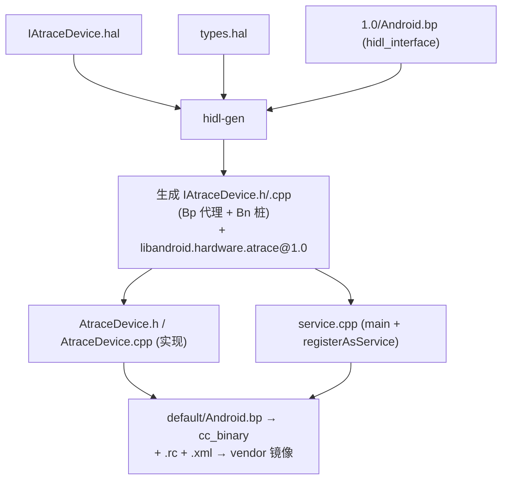
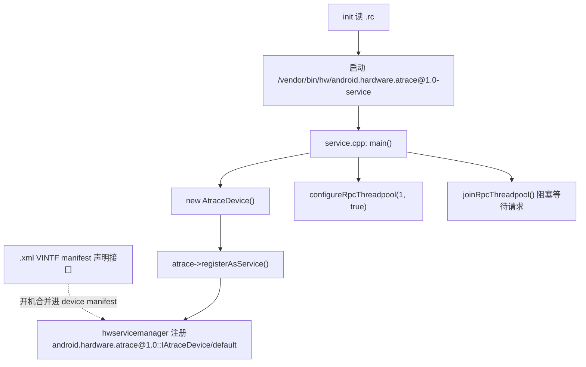
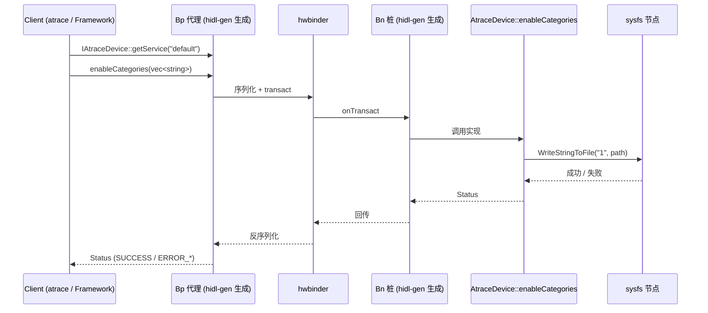
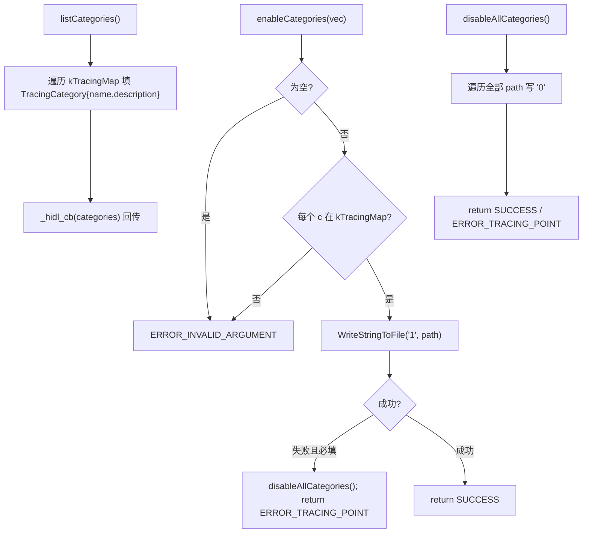

先读用户附带的两个 md 和 atrace HAL 的核心源码，以便准确还原调用链。
附带的 `hal1.md` / `hal_test.md` 其实是我们之前建 `demo` HAL 的对话记录，与 atrace 无关。下面基于 atrace 实际源码（`IAtraceDevice.hal`、`types.hal`、`AtraceDevice.{h,cpp}`、`service.cpp`）绘制调用流程图。

先明确各文件在流程中的角色：

- `1.0/IAtraceDevice.hal`：接口定义（`listCategories` / `enableCategories` / `disableAllCategories`）
- `1.0/types.hal`：数据结构（`Status` 枚举、`TracingCategory` 结构）
- `1.0/Android.bp`：`hidl_interface`，驱动 `hidl-gen` 生成 `IAtraceDevice.h/.cpp`（含 Bp 代理与 Bn 桩）并产出 `libandroid.hardware.atrace@1.0`
- `1.0/default/AtraceDevice.h` + `AtraceDevice.cpp`：接口的业务实现（含 `kTracingMap` 与 sysfs 读写）
- `1.0/default/service.cpp`：`main()`，`new AtraceDevice()` + `registerAsService()`
- `default/Android.bp` + `.rc` + `.xml`：编成 vendor 二进制、init 拉起、VINTF 声明

图1：构建期文件生成与依赖

图2：服务启动 / 注册流程

图3：客户端调用流程（以 `enableCategories` 为例，跨进程）

图4：`AtraceDevice` 三个方法的实现逻辑（`AtraceDevice.cpp`）

要点总结：atrace HAL 是典型的 binderized HIDL 结构——`*.hal` 只定义契约，`hidl-gen` 自动生成 Bp/Bn 通信骨架，真正的业务在 `AtraceDevice.cpp` 里借 `kTracingMap` 把 category 映射到具体 sysfs 节点（`/sys/kernel/debug/tracing/events/.../enable`）并读写 `"1"`/`"0"`。`service.cpp` 仅负责把实现对象注册进 `hwservicemanager`，之后所有客户端调用都经 hwbinder 跨进程落到 `AtraceDevice` 的实现方法上。

需要我把这些流程图也渲染成一份 `atrace_hal_flow.md` 文档落到仓库吗？