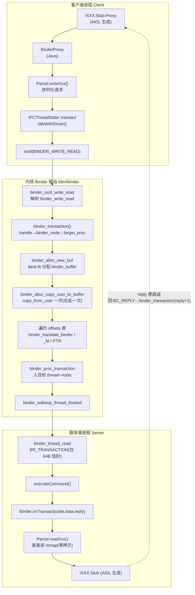
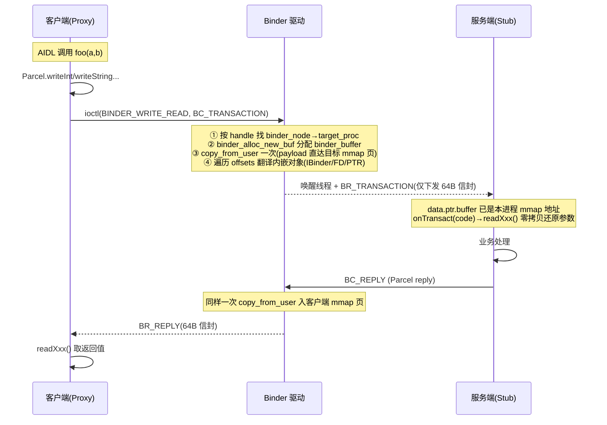
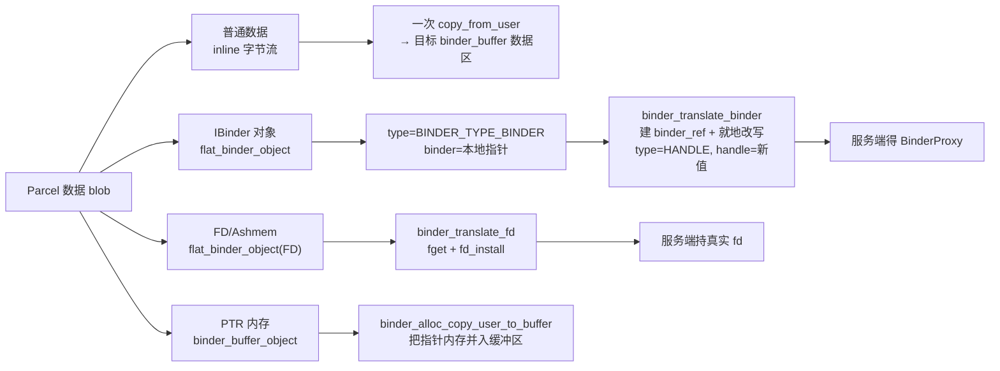

# Binder 数据结构传输示意流程分析

> 基于 cells-android10 内核 Binder 驱动（`kernel/drivers/android/`）全链路整理
> 整理日期：2026-07-24
> 配套用户态代码：`frameworks/native/libs/binder`（Native）、Java Framework、AIDL 生成代码


我们要把"Binder 传数据"这条链路上**每一个函数调用**都扒出来,并标注每一步的真实参数。先把还没精读的几个关键函数本体和签名读出来,确保参数名/类型都来自你仓库的真实代码。
数据复制核心函数在 `binder_alloc.c` 里没匹配到,可能名字不同。我并行读关键函数本体,并重新搜复制函数定义。
复制函数和读路径还没精读。我并行读 `binder_alloc.c` 的复制本体,以及 `binder_transaction` 收尾投递、`binder_thread_read` 构造 `BR_TRANSACTION` 两段。
读一下 `binder_thread_read` 里构造 `BR_TRANSACTION` 信封并拷贝到用户态那一段,以及翻译循环头部拿到 `object_offset` 的来源。
`binder_thread_read` 里 `BR_TRANSACTION` 真正填字段并 `put_user` 的部分还没读到。我定位那段。
下面把"一次 Binder 调用来回"中**所有参与数据搬运的函数**串成一条调用链,并给每个函数标注它在你的 `cells-android10` 仓库里被调用时的**真实参数值**。为了让参数具体,我固定一个示例:

客户端 `Client`(pid=A,所属 `binder_proc *A`)调用服务端 `Server`(pid=B,`binder_proc *B`)的方法,`code=7`,`Parcel` 里内联了 `int` + `String` + 一个 `IBinder` 回调,回调对象在内嵌数据区的**偏移 `P`** 处;`data_size=N`,`offsets_size=8`(64 位下一个偏移 8 字节)。下面所有参数值都基于这个例子。

---

## 阶段 0:用户态填信封(驱动外,作为入口约定)

`IPCThreadState::writeTransactionData` 把参数填进 `binder_transaction_data tr`,随后 `ioctl(binder_fd, BINDER_WRITE_READ, &bwr)`。进入内核后 `binder_ioctl_write_read` 调用 `binder_thread_write(proc=A, thread=client_thread, bwr.write_buffer, bwr.write_size, &bwr.write_consumed)`。

---

## 阶段 1:写路径 —— 进入 BC_TRANSACTION

```4154:4158:kernel/drivers/android/binder.c
if (copy_from_user(&tr, ptr, sizeof(tr)))
    return -EFAULT;
ptr += sizeof(tr);
binder_transaction(proc, thread, &tr.transaction_data,
                   cmd == BC_REPLY_SG, tr.buffers_size);
```

这一步的具体参数:

```
copy_from_user(&tr, ptr, sizeof(struct binder_transaction_data)=64)
  → tr 的内容:
      tr.target.handle      = H        (Server 的 handle,SM 为 0)
      tr.code               = 7
      tr.flags              = 0        (同步;oneway 时为 TF_ONE_WAY)
      tr.data_size          = N
      tr.offsets_size       = 8
      tr.data.ptr.buffer    = <Client 用户态 Parcel 指针>
      tr.data.ptr.offsets   = <Client 用户态偏移表指针>

binder_transaction(
      proc   = A,                            /* 调用方进程 */
      thread = client_thread,                /* 发起线程 */
      tr     = &tr.transaction_data,         /* 上面这份信封 */
      reply  = cmd==BC_REPLY_SG (本例为 0),  /* 不是回复 */
      buffers_size = tr.buffers_size)        /* 通常为 0 */
```

---

## 阶段 2:`binder_transaction` 内核核心(签名在 `binder.c:3201`)

```3201:3203:kernel/drivers/android/binder.c
static void binder_transaction(struct binder_proc *proc,
                               struct binder_thread *thread,
                               struct binder_transaction_data *tr, int reply,
```

### 步骤 2a — 解析目标(handle → node)

按 `tr->target.handle` 找到 `binder_node *target_node`,再拿 `target_proc = target_node->proc`(本例 = `B`)。失败则回 `BR_DEAD_REPLY`。

### 步骤 2b — 在**目标进程**分配缓冲区

```3498:3504:kernel/drivers/android/binder.c
t->buffer = binder_alloc_new_buf(&target_proc->alloc, tr->data_size,
				 tr->offsets_size, extra_buffers_size,
				 !reply && (t->flags & TF_ONE_WAY));
```

具体参数值:

```
binder_alloc_new_buf(
      alloc           = &B->alloc,          /* 注意:目标进程 B 的分配器 */
      data_size       = N,
      offsets_size    = 8,
      extra_buffers  = 0,
      is_async       = !0 && (0 & TF_ONE_WAY) = false)   /* 同步事务 */
→ 返回 struct binder_buffer * (或 ERR_PTR(-ENOSPC))
```

### 步骤 2c — 拷贝数据 blob(这就是"唯一一次拷贝")

```3530:3537:kernel/drivers/android/binder.c
if (binder_alloc_copy_user_to_buffer(&target_proc->alloc, t->buffer, 0,
		(const void __user *)(uintptr_t) tr->data.ptr.buffer,
		tr->data_size)) {
```

具体参数:

```
binder_alloc_copy_user_to_buffer(
      alloc          = &B->alloc,
      buffer         = t->buffer,           /* 步骤 2b 分配出来的块 */
      buffer_offset  = 0,                   /* 从块首开始写 */
      from           = (void __user*)tr->data.ptr.buffer,  /* Client 用户态指针 */
      bytes          = N)
```

函数内部逐页做真正的拷贝(`binder_alloc.c:1170`):

```1179:1197:kernel/drivers/android/binder_alloc.c
while (bytes) {
	page = binder_alloc_get_page(alloc, buffer, buffer_offset, &pgoff);
	size = min_t(size_t, bytes, PAGE_SIZE - pgoff);
	kptr = kmap(page) + pgoff;
	ret = copy_from_user(kptr, from, size);   /* ★ 唯一一次跨进程拷贝 */
	kunmap(page);
	...
}
```

### 步骤 2d — 拷贝偏移表(紧跟在数据区之后)

```
binder_alloc_copy_user_to_buffer(
      alloc          = &B->alloc,
      buffer         = t->buffer,
      buffer_offset  = ALIGN(N, sizeof(void*)),  /* 数据区末尾对齐处 */
      from           = (void __user*)tr->data.ptr.offsets,
      bytes          = 8)
```

### 步骤 2e —(可选)拷贝安全上下文

```3519:3521:kernel/drivers/android/binder.c
binder_alloc_copy_to_buffer(&target_proc->alloc,
                                    t->buffer, buf_offset,
                                    secctx, secctx_sz);
```

### 步骤 2f — 遍历偏移表,逐个翻译内嵌对象(关键循环)

循环从 `buffer_offset=0` 开始,每次从偏移表读一个 `object_offset`,再翻译那个对象:

```3592:3598:kernel/drivers/android/binder.c
binder_alloc_copy_from_buffer(&target_proc->alloc,
                                      &object_offset,
                                      t->buffer,
                                      buffer_offset,
                                      sizeof(object_offset));
object_size = binder_get_object(target_proc, t->buffer,
                                        object_offset, &object);
```

第一轮的具体参数:

```
binder_alloc_copy_from_buffer(
      alloc          = &B->alloc,
      dest           = &object_offset,      /* 输出:读到 P */
      buffer         = t->buffer,
      buffer_offset  = 0,                   /* 偏移表第 0 项 */
      bytes          = 8)

binder_get_object(
      proc     = B,
      buffer   = t->buffer,
      offset   = P,                         /* 数据区里第 P 字节 */
      object   = &object)                   /* 输出:解析后的对象 */
→ 返回 object_size = sizeof(struct flat_binder_object) = 24
```

`binder_get_object` 内部先 `copy_from_buffer` 读公共头,按 `hdr->type` 判定对象大小(`binder.c:2477`):

```2477:2492:kernel/drivers/android/binder.c
switch (hdr->type) {
case BINDER_TYPE_BINDER:  object_size = sizeof(struct flat_binder_object); break;
case BINDER_TYPE_FD:      object_size = sizeof(struct binder_fd_object); break;
case BINDER_TYPE_PTR:     object_size = sizeof(struct binder_buffer_object); break;
case BINDER_TYPE_FDA:     object_size = sizeof(struct binder_fd_array_object); break;
}
```

本例 `hdr->type = BINDER_TYPE_BINDER`,于是进入 `binder_translate_binder`:

```3618:3620:kernel/drivers/android/binder.c
fp = to_flat_binder_object(hdr);
ret = binder_translate_binder(fp, t, thread);
```

具体参数:

```
binder_translate_binder(
      fp      = (struct flat_binder_object*) 指向 t->buffer 内偏移 P 处,
      t       = 当前事务,
      thread  = client_thread)
```

`binder_translate_binder` 在 `B` 里为这个实体建引用,再**就地改写**对象,把结果写回缓冲区(`binder.c:2819`):

```2819:2831:kernel/drivers/android/binder.c
ret = binder_inc_ref_for_node(target_proc, node, ... , &rdata);
if (fp->hdr.type == BINDER_TYPE_BINDER)
	fp->hdr.type = BINDER_TYPE_HANDLE;
fp->binder = 0;
fp->handle = rdata.desc;   /* B 侧新 handle = H' */
fp->cookie = 0;
```

改写后,把新对象写回目标缓冲区:

```
binder_alloc_copy_to_buffer(
      alloc          = &B->alloc,
      buffer         = t->buffer,
      buffer_offset  = P,                   /* 同一个偏移 */
      src            = fp,                  /* 已改写成 HANDLE/H' 的对象 */
      bytes          = sizeof(*fp)=24)
```

随后 `buffer_offset += 8`(跳过偏移表里的下一个 8 字节项),`off_min = P + 24`,若还有更多偏移则重复 2f。本例只有一个对象,循环结束。

> 若对象是 `BINDER_TYPE_FD`,走 `binder_translate_fd(fd, t, thread, ...)`(`binder.c:2911`);若是 `BINDER_TYPE_PTR`,走 `binder_translate_fd`/`binder_alloc_copy_user_to_buffer` 把指针指向的内存也复制进事务缓冲区(对应 `binder.c:3728` 的 `binder_alloc_copy_user_to_buffer(&B->alloc, t->buffer, ...)`)。

### 步骤 2g — 投递并唤醒 Server

```3778:3780:kernel/drivers/android/binder.c
tcomplete->type = BINDER_WORK_TRANSACTION_COMPLETE;
t->work.type = BINDER_WORK_TRANSACTION;
```

同步事务(非 oneway)的投递:

```3805:3815:kernel/drivers/android/binder.c
binder_enqueue_deferred_thread_work_ilocked(thread, tcomplete);
t->need_reply = 1;
t->from_parent = thread->transaction_stack;
thread->transaction_stack = t;
...
if (!binder_proc_transaction(t, target_proc, target_thread)) { ... }
```

```
binder_proc_transaction(
      t       = 当前事务,
      proc    = B,                 /* 目标进程 */
      thread  = target_thread)     /* 选定的 Server 线程 */
  → oneway      = !!(t->flags & TF_ONE_WAY) = false
  → binder_enqueue_thread_work_ilocked(target_thread, &t->work)
  → binder_wakeup_thread_ilocked(B, target_thread, !oneway=true)
```

---

## 阶段 3:读路径 —— Server 取出 `BR_TRANSACTION`

Server 阻塞在 `ioctl(BINDER_WRITE_READ, &bwr)` 的读部分,内核进入:

```4490:4493:kernel/drivers/android/binder.c
static int binder_thread_read(struct binder_proc *proc,
                              struct binder_thread *thread,
                              binder_uintptr_t binder_buffer, size_t size,
                              binder_size_t *consumed, int non_block) {
```

具体参数:

```
binder_thread_read(
      proc          = B,
      thread        = server_thread,
      binder_buffer = (binder_uintptr_t)bwr.read_buffer,  /* Server 用户态读缓冲 */
      size          = bwr.read_size,
      consumed      = &bwr.read_consumed,
      non_block     = 0)
```

它从 `server_thread->todo` 取出 `BINDER_WORK_TRANSACTION`,`t = container_of(w, struct binder_transaction, work)`,然后**构造新的信封**下发(`binder.c:4757`):

```4757:4792:kernel/drivers/android/binder.c
struct binder_node *target_node = t->buffer->target_node;
...
trd->target.ptr = target_node->ptr;     /* Server 自己的 BBinder 指针 */
trd->cookie = target_node->cookie;
cmd = BR_TRANSACTION;
trd->code = t->code;                    /* = 7 */
trd->flags = t->flags;                  /* = 0 */
trd->sender_pid = <A 的 pid>;           /* 来自 binder_get_txn_from(t) */
trd->sender_euid = ...;
trd->data_size = t->buffer->data_size;            /* = N */
trd->offsets_size = t->buffer->offsets_size;      /* = 8 */
trd->data.ptr.buffer = (uintptr_t)t->buffer->user_data;  /* ★ B 的 mmap 地址 */
trd->data.ptr.offsets = trd->data.ptr.buffer + ALIGN(N, sizeof(void*));
```

注意 `trd->data.ptr.buffer` 填的是 **`t->buffer->user_data`** —— 这是 Server 进程 mmap 区里映射了那块物理页的地址。最后:

```4766:4767:kernel/drivers/android/binder.c
cmd = BR_TRANSACTION;
```

```
put_user(cmd=BR_TRANSACTION, ptr)            /* 先写命令字 */
copy_to_user(ptr, &tr, trsize)               /* 再写整个信封 tr */
```

---

## 阶段 4:用户态收尾(Server)

`IPCThreadState::executeCommand(BR_TRANSACTION, ...)` 调到 `BBinder::onTransact(code=7, data, reply)`:

- `data.ptr.buffer` 已被驱动设为 `t->buffer->user_data`(B 的 mmap 地址),所以 `int code`、`String msg` 是**直接读共享物理页,零额外拷贝**;
- 在偏移 `P` 处 `readStrongBinder()` 读到 `flat_binder_object{type=BINDER_TYPE_HANDLE, handle=H'}`,于是构造出 `BpBinder(H')` 作为那个回调代理。

---

## 阶段 5:回程(同步场景)

Server 处理完发 `BC_REPLY`,再次进入 `binder_transaction(proc=B, thread=server_thread, &tr, reply=1, ...)`。回复时它按 `thread->transaction_stack` 弹出 `in_reply_to` 找到最初发起的 `client_thread`,走相同的拷贝/翻译路径,最后:

```3790:3792:kernel/drivers/android/binder.c
binder_enqueue_thread_work_ilocked(target_thread, &t->work);  /* target_thread=client_thread */
binder_inner_proc_unlock(target_proc);
wake_up_interruptible_sync(&target_thread->wait);
```

Client 的 `binder_thread_read` 收到 `cmd = BR_REPLY`,并把 `trd->target.ptr = 0`(`binder.c:4768`),完成闭环。

---

## 全景调用链(带参数摘要)

```
ioctl(BINDER_WRITE_READ)
 └─ binder_ioctl_write_read(A, client_thread, &bwr)
    └─ binder_thread_write(A, client_thread, wbuf, wsize, &wconsumed)
       ├─ copy_from_user(&tr, ptr, 64)            // tr.handle=H, code=7, data_size=N, offsets_size=8
       └─ binder_transaction(A, client_thread, &tr.transaction_data, reply=0, buffers_size)
          ├─ [2a] handle→target_node→target_proc = B
          ├─ [2b] binder_alloc_new_buf(&B->alloc, N, 8, 0, is_async=false) → t->buffer
          ├─ [2c] binder_alloc_copy_user_to_buffer(&B->alloc, t->buffer, 0, client_ptr, N)  // 唯一一次 copy_from_user
          ├─ [2d] binder_alloc_copy_user_to_buffer(&B->alloc, t->buffer, ALIGN(N,8), client_off, 8)
          ├─ [2e] binder_alloc_copy_to_buffer(&B->alloc, t->buffer, off, secctx, sz)
          ├─ [2f] loop:
          │    ├─ binder_alloc_copy_from_buffer(&B->alloc, &obj_off, t->buffer, 0, 8) → obj_off=P
          │    ├─ binder_get_object(B, t->buffer, P, &object) → 24
          │    ├─ binder_translate_binder(fp@P, t, client_thread)
          │    │     ├─ binder_inc_ref_for_node(B, node, …, &rdata) → rdata.desc=H'
          │    │     └─ 改写 fp: type=HANDLE, binder=0, handle=H', cookie=0
          │    └─ binder_alloc_copy_to_buffer(&B->alloc, t->buffer, P, fp, 24)
          └─ [2g] binder_proc_transaction(t, B, server_thread)
                 ├─ binder_enqueue_thread_work_ilocked(server_thread, &t->work)
                 └─ binder_wakeup_thread_ilocked(B, server_thread, sync=true)

ioctl(BINDER_WRITE_READ)  [Server 侧读]
 └─ binder_thread_read(B, server_thread, bwr.read_buffer, rsize, &rconsumed, non_block=0)
    ├─ t = container_of(w, binder_transaction, work)
    ├─ 填 trd: target.ptr=node->ptr, code=7, data_size=N, offsets_size=8,
    │         data.ptr.buffer=t->buffer->user_data  // 关键:Server 的 mmap 地址
    ├─ put_user(BR_TRANSACTION, ptr)
    └─ copy_to_user(ptr, &tr, trsize)
       → BBinder::onTransact(7, data, reply); 直接读 mmap 页;readStrongBinder()→BpBinder(H')
```

需要的话,下一步我可以单独把 `binder_alloc_copy_from_buffer` / `binder_get_object` 这段"从内核缓冲区按偏移取对象"的边界校验(比如 `offset` 非 4 字节对齐、`object_offset < off_min` 的拒绝逻辑,对应 `binder.c:2469`、`3599`)展开,或者把 `BINDER_TYPE_FD` 的 `binder_translate_fd` 翻页、装新 fd 的完整参数也补成同样的格式。

(注:你当前在 ask 模式,我只能做只读分析,无法直接把这份跟踪落到 `binder.md`。如需成文切到 craft 模式即可。)


> <!-- 注释：本文所说"一次拷贝"指 payload 只经历一次 copy_from_user；
>      驱动另用一次 copy_to_user 仅回写 64 字节信封(binder_transaction_data)，
>      不搬运 payload，故不计入数据拷贝次数 -->

## 〇、术语约定（读图前先对齐）

- `binder_proc`：每进程一个，持有 `binder_alloc`（mmap 缓冲池）、`nodes`、`refs_by_desc` 红黑树。
- `binder_thread`：每 Binder 线程一个，持有 `todo` 工作队列与 `transaction_stack`。
- `binder_node`：服务端实体（本地 BBinder），带 `ptr/cookie` 指向用户态对象。
- `binder_ref`：客户端对某个 node 的引用，其 `desc` 字段就是用户态看到的 handle。
- `binder_buffer`：一次事务在**目标进程** mmap 池里分配的内核缓冲区，内含"数据 blob + 偏移表"。

## 一、整体分层与数据载体流向



> 注释：数据 blob 由 `copy_from_user` **一次性**拷进目标进程的 mmap 内核页；
> 该物理页在分配时已通过 `vm_insert_page` 同时映射进目标进程用户空间，
> 所以服务端 `readXxx()` 直接读自己的虚拟地址，**无需第二次拷贝**（见第五节）。

## 二、一次同步事务的数据流时序



> 注释：时序里驱动侧**没有** `copy_to_user` 搬运 payload；
> `BR_TRANSACTION`/`BR_REPLY` 只携带"命令字 + `binder_transaction_data` 信封"，
> 信封中的 `data.ptr.buffer` 被驱动填成 `t->buffer->user_data`（目标进程 mmap 地址），
> payload 早已躺在目标进程可直接读取的物理页上。

## 三、Parcel 中三类数据的传输差异（核心）

Binder 传输的不是"对象"，而是**序列化的字节流 + 特殊对象描述符**。驱动借助"偏移表（offsets）"定位 blob 中内嵌的对象，对不同类型数据区别处理：

| 数据类型 | Parcel 中的形态 | 驱动内处理 | 限制/去向 |
|----------|----------------|------------|-----------|
| 普通数据（int/String/byte[] 等） | 内联字节流 | `binder_alloc_copy_user_to_buffer` 一次 `copy_from_user` 到目标 `binder_buffer` 数据区 | 受 mmap 池总量约束（≈1MB−2×PAGE_SIZE），且需连续空闲块 |
| Binder 对象（IBinder） | `flat_binder_object`(type=BINDER_TYPE_BINDER) | `binder_translate_binder`：在目标进程建 `binder_ref` 分配 **handle**，并把对象**就地改写**为 `BINDER_TYPE_HANDLE`+新 handle；服务端读到 `BinderProxy` | 跨进程后变代理，再次 transact 即回到原进程 |
| 文件描述符（FD / Ashmem / ParcelFileDescriptor） | `flat_binder_object`(type=BINDER_TYPE_FD) | `binder_translate_fd`：`fget` 源 fd 后在目标进程 `fd_install` 新 fd，两 fd 指向同一 `struct file` | 大块数据（>数百 KB）应走 **ashmem/FD**，不占 1MB 池，规避 `TransactionTooLargeException` |
| 指针型内存（BINDER_TYPE_PTR / FDA） | `binder_buffer_object` | 驱动把指针指向的用户内存额外 `copy_from_user` 并入事务缓冲区（支持 parent/child 嵌套修正） | 用于 AIDL out 参数、大块二进制（BC_TRANSACTION_SG） |



> 注释：客户端写入的是 `type=BINDER_TYPE_BINDER + 本地指针`，**驱动翻译后才变成 handle**——
> 不是"客户端传入 binder_node 引用"；node 是驱动首次见到该实体时才建的。

## 四、偏移表（offsets）与对象翻译机制（重点）

`offsets` 是一串 `binder_size_t`（64 位下 8 字节）数组，每个值表示"数据 blob 中第几个字节处内嵌了一个对象"。驱动靠它区分"普通字节"与"需要翻译的对象"。核心循环在 `binder_transaction()` 末尾（`kernel/drivers/android/binder.c:3592` 起）：

```c
/* 遍历 offsets 表，逐个翻译内嵌对象 */
binder_alloc_copy_from_buffer(&target_proc->alloc,
                              &object_offset,   /* 从 offsets[i] 读出对象在 blob 中的偏移 P */
                              t->buffer, buffer_offset, sizeof(object_offset));
object_size = binder_get_object(target_proc, t->buffer,
                                object_offset, &object);  /* 解析对象头，返回对象尺寸 */
/* object_size==0 或 object_offset < off_min → BR_FAILED_REPLY(-EINVAL)，防重叠/防越界 */
hdr = &object.hdr;
switch (hdr->type) {
case BINDER_TYPE_BINDER:   /* 实体→代理：建 ref + 就地改写 */
    binder_translate_binder(fp, t, thread);        /* binder.c:2819 改写为 HANDLE */
    binder_alloc_copy_to_buffer(&target_proc->alloc,
                                t->buffer, object_offset, fp, sizeof(*fp));
    break;
case BINDER_TYPE_FD:       /* 跨进程传 fd */
    binder_translate_fd(fd, t, thread, ...);       /* binder.c:2911 */
    break;
case BINDER_TYPE_PTR:      /* 额外用户内存并入缓冲区 */
    binder_alloc_copy_user_to_buffer(&target_proc->alloc, t->buffer, ...);  /* binder.c:3728 */
    break;
}
```

> 注释：`off_min` 单调递增（每轮更新为 `object_offset + object_size`），保证对象不重叠、偏移表严格有序；
> 偏移非 4 字节对齐或越界会被 `binder_get_object`（`binder.c:2460`）直接拒掉。

## 五、"一次拷贝"的物理底层（VM_MIXEDMAP + 逐页映射）

为何能省掉第二次拷贝？关键在于 `binder_mmap` 给 VMA 打上 `VM_MIXEDMAP`，允许驱动用 `vm_insert_page` 把零散物理页映射成一段连续的进程虚拟地址：

```c
/* binder.c —— mmap 时设置标志 */
vma->vm_flags |= VM_DONTCOPY | VM_MIXEDMAP;  /* 逐页插入；fork 不继承此映射 */
vma->vm_flags &= ~VM_MAYWRITE;               /* 用户态只读，只能经驱动填充 */
```

```c
/* binder_alloc.c:187 binder_update_page_range —— 分配事务缓冲时逐页操作 */
page->page_ptr = alloc_page(GFP_KERNEL | __GFP_HIGHMEM | __GFP_ZERO);
vm_insert_page(vma, user_page_addr, page[0].page_ptr);
/* 同一物理页：内核 kmap 可写 + 目标进程用户态可读，双映射 */
```

- 同一块物理页，既被内核 `kmap` 访问（`binder_alloc_do_buffer_copy` 里逐页 `copy_from_user`），又映射到目标进程 mmap 区（即 `t->buffer->user_data`）。
- 事务时 `copy_from_user` 一次写入该页；目标服务端直接读自己的虚拟地址，**零成本**。
- 页回收走 LRU 缓存（`binder_alloc_lru`），内存紧张时由 shrinker `zap_page_range` + `__free_page` 真正归还。

> 注释：本 cells 内核的 `binder_vm_fault` 直接返回 `VM_FAULT_SIGBUS`——
> 缓冲被 `BC_FREE_BUFFER` 释放后任何再访问都会 SIGBUS，驱动假定用户态不会越界触碰。

## 六、关键约束（与数据结构传输直接相关）

- **mmap 池大小**：`min(用户态请求, 驱动硬上限 SZ_4M)`；用户态 `ProcessState` 只请求 `MMAP_SIZE = 1MB − 2×PAGE_SIZE`，所以常规 app 池 ≈ **1MB−8KB**。
- **单事务上限**：≈ 池大小（减去 `binder_buffer` 头与对齐开销）；异步（oneway）额度 `free_async_space = 池/2` ≈ **512KB**。
- **TransactionTooLargeException 触发条件**：`binder_alloc_new_buf` 返回 `ERR_PTR(-ENOSPC)`——"无足够**连续**空闲块"**或**"异步额度不足"。即便没超 1MB，碎片化也会触发。大 list/bitmap 改用 `Ashmem`/`ParcelFileDescriptor`（走 FD，不占此池）。
- **线程池**：`BINDER_SET_MAX_THREADS` 默认 **15** 个 Binder 线程，`binder_thread_read` 从 `todo` 取事务；在 Binder 线程中做重 IO/持锁会耗尽线程池导致整机 IPC 阻塞。
- **oneway 异步**：`flags` 含 `TF_ONE_WAY` 时不等待 `BR_REPLY`，仅完成事务拷贝即返回，适合通知类数据传输；但受 512KB 异步额度约束，狂发 oneway 会 `-ENOSPC`。
- **对象跨进程转换**：客户端 `BpBinder` → `flat_binder_object(BINDER)` → 驱动建 `binder_ref` 改写为 `HANDLE` → 服务端 `BinderProxy`，这是 Binder"传递 Binder 自身"能力的本质。

## 七、参考源码位置（本仓库）

| 机制 | 文件:行 |
|------|---------|
| 信封结构 `binder_transaction_data` | `kernel/include/uapi/linux/android/binder.h` |
| 写入口 `binder_thread_write` / `BC_TRANSACTION` | `kernel/drivers/android/binder.c`（`binder_thread_write` 内，4154 附近） |
| 事务核心 `binder_transaction` | `kernel/drivers/android/binder.c:3201` |
| 缓冲分配 `binder_alloc_new_buf`（best-fit） | `kernel/drivers/android/binder_alloc.c`（`binder_alloc_new_buf_locked`） |
| 一次拷贝 `binder_alloc_copy_user_to_buffer` | `kernel/drivers/android/binder_alloc.c:1170` |
| 对象解析 `binder_get_object` | `kernel/drivers/android/binder.c:2460` |
| 对象翻译 `binder_translate_binder` | `kernel/drivers/android/binder.c:2791` |
| FD 翻译 `binder_translate_fd` | `kernel/drivers/android/binder.c:2911` |
| 投递唤醒 `binder_proc_transaction` | `kernel/drivers/android/binder.c:3108` |
| 读路径构造 `binder_thread_read` | `kernel/drivers/android/binder.c:4490` |
| 物理页映射 `binder_update_page_range` / `VM_MIXEDMAP` | `kernel/drivers/android/binder_alloc.c:187` / `binder.c`（`binder_mmap`） |
